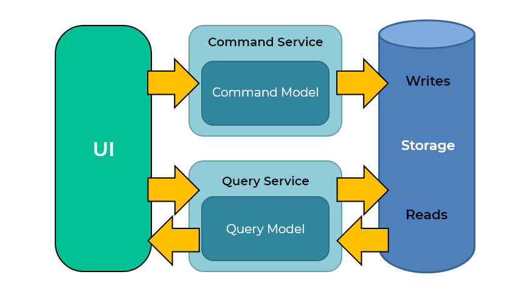

# Reservation-api

Esta API se utiliza para gestionar reservas para clientes, en donde un cliente máximo puede tener una reserva y un número solo puede estar reservado una vez. Ademas se puede consultar las reservas realizadas por los clientes.

## Analisis de alternativas

Para resolver el problema, se hizo el siguiente analisis de estás 2 alternativas

### Alternativa 1 (Lock service con Elasticache)

Cómo se puede ver en la anterior imagen, la alternativa planteada es hacer un Lock Service por request, donde podamos bloquear los recursos que llegan API a través del id del cliente y número de reserva y estos se almacenen en un servicio de AWS/Elasticache en donde todos las instancias que levante el balanceador de carga podría consulta de manera rápida y eficiente si ya hay una operación en curso para ese cliente especifico o para ese número de reserva, permitiendo que solo se procese una peteción a la vés por cliente o por número de reserva.

### Alternativa 2 (Unique Index en la base de datos)

Cómo la base de datos relacional es una instacia única para la aplicación (independientemente del número de instancias que levante el balanceador de carga), es una buena manera de controlar que la información que se vaya a persistir dentro de la misma sea consistente y por ende, se propone estas reglas para los atributos de la base de datos:

| client_id  |  reservation |   
|---|---|
|  Unique Index | Unique Index  |

De esta manera, en el momento que un cliente quiera tener más de una reserva, la base de datos va a fallar porque ya existe un registro para dicho cliente, así también, cuando se quiera reserva un número previamente reservado, también fallará la inserción de la misma; se le da un manejo especial a ese tipo de errores para que el API pueda responder correctamente con las reglas de negocio planteadas.

### Alternativa seleccionada

Con base al analisis previo, se opta por la alternativa 2, por temas de agilidad y tiempo para prensentar la prueba técnia.

## Tecnologías utilizadas

- Go 1.19
- Gin Gonic
- Base de datos Postgres

## Arquitectura:

Se utilizo la arquitectura hexagonal con el fin de separar la aplicación en distintas capas con su propia responsabilidad y de esta manera desacoplar el core del negocio (dominio) de factores o dependencias externas.

## Patrones:

Se utilizo el patrón de diseño CQRS para separar las operaciones de lectura y escritura en la aplicación.

## Principios:

Se implementaron la mayoria de principios SOLID en la aplicación, con el fin de tener un aplicativo escalable y mantenible en el tiempo.

### Nota:
En la raíz del proyecto se encuentra una carpeta docs/postman_collections en la cual se podrá encontrar los diferentes consumos tanto para el ambiente local como para el de producción con los diferentes escenarios y de esta manera poder probar de una manera más eficiente los casos de prueba que se pueden presentar.
